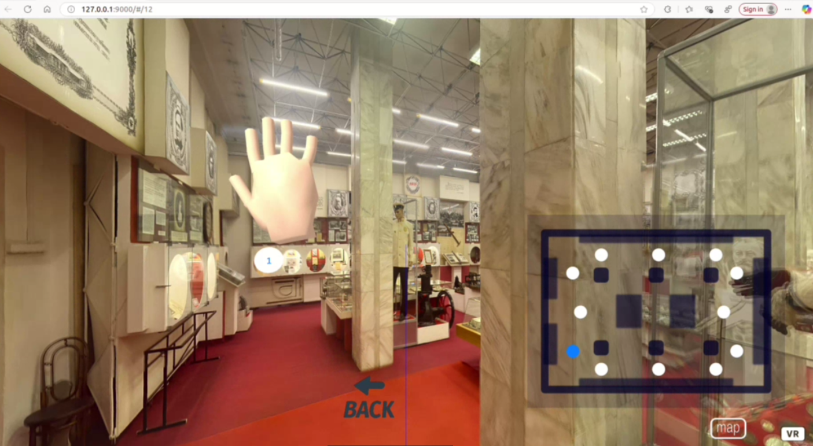

# 🏛️ Museum AR: Цифровой двойник музея МГТУ

Десктопное приложение с интерактивным цифровым двойником музея МГТУ им. Н.Э. Баумана с поддержкой **жестового управления** и классического управления мышью.

## 📸 Демонстрация работы

*Интерфейс приложения с жестовым управлением и 3D моделью музея МГТУ*

## ✨ Особенности

- **🎮 Двойной интерфейс управления**: жестовый контроль через веб-камеру и классическое управление мышью
- **👁️ Компьютерное зрение**: точный трекинг ладони в реальном времени
- **🖐️ Интуитивные жесты**: навигация, взаимодействие с экспонатами
- **🏛️ Аутентичная атмосфера**: полное 3D воссоздание музея МГТУ
